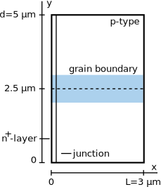
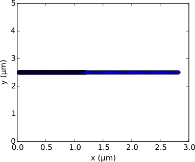

Make a system and solve the problem
===================================

The example treated here is in the file ``sim.py`` in the ``examples`` directory in the root
directory of the distribution. Also, all the descriptions of the methods used
here are in Sec. :ref:`label_code`.

Build a system
--------------

Suppose we want to simulate a 2D pn junction (homojunction) with a line of
defects as depicted below.  

We start by importing the sesame package and numpy::

    import sesame
    import numpy as np

Create an instance of the builder::

    sys = sesame.Builder()

and add features to it. Define the material using a dictionary and add it to
the system::

    # Dimensions of the system
    L = 3e-6 # [m]
    d = 5e-6 # [m]
    junction = 10e-9 # size of the n-region [m]

    # Dictionary with the material parameters
    CdTe = {'Nc':8e17*1e6, 'Nv':1.8e19*1e6, 'Eg':1.5, 'epsilon':9.4,
            'mu_e':100*1e-4, 'mu_h':100*1e-4, 'tau_e':10e-9, 'tau_h':10e-9, 
            'RCenergy':0, 'band_offset':0}

    # Add the material to the system
    sys.add_material(((0,0,0), (L,d,0)), CdTe)

where ``Nc`` (``Nv``) is the effective density of states of the conduction
(valence) band (:math:`\mathrm{m^{-3}}`), ``Eg`` is the material band gap (:math:`\mathrm{eV}`),
``epsilon`` is the material's dielectric constant, ``mu_e`` (``mu_h``) is the
electron (hole) mobility (:math:`\mathrm{m^2/(V\cdot s)}`), ``tau_e`` (``tau_h``) is the
electron (hole) bulk lifetime (:math:`\mathrm{s}`), ``RCenergy`` is the bulk
recombination centers energy level (:math:`\mathrm{eV}`), and ``band_offset`` is a band
offset that sets the zero of potential (:math:`\mathrm{eV}`). Let's add the dopants::

    # Add the donors
    nD = 1e17 * 1e6 # [m^-3]
    sys.add_donor(((0,0,0), (junction,d,0)), nD)

    # Add the acceptors
    nA = 1e15 * 1e6 # [m^-3]
    sys.add_acceptor(((junction,0,0), (L,d,0)), nA)

Now that we have the inerior of the system, we specify the contacts boundary
conditions. We choose to have perfectly selective contacts::

    # Define the surface recombination velocities for electrons and holes [m/s]
    Sn_left, Sp_left, Sn_right, Sp_right = 1e50, 0, 0, 1e50
    sys.contacts(Sn_left, Sp_left, Sn_right, Sp_right)

Create a mesh and add it to the system. We create an irregular mesh that
contains more nodes in the pn junction depletion region and around the defect
line::

    x = np.concatenate((np.linspace(0,1.2e-6, 300, endpoint=False), 
                        np.linspace(1.2e-6, L, 100)))
    y = np.concatenate((np.linspace(0, 2.25e-6, 100, endpoint=False), 
                        np.linspace(2.25e-6, 2.75e-6, 100, endpoint=False),
                        np.linspace(2.75e-6, d, 100)))
    sys.mesh(x, y)

We add a generation profile::

    phi = 1e21 # photon flux [1/(m^2 s)]
    alpha = 2.3e6 # absorption coefficient [1/m]

    # Define a function for the generation rate
    f = lambda x, y, z: phi * alpha * np.exp(-alpha * x)
    sys.illumination(f)

Now we add some local charges to simulate the defect line of our system. We
define the defect recombination paramters and give the two points that define
the line::

    S   = 1e5 * 1e-2           # trap recombination velocity [m/s]
    EGB = -0.25                # energy of gap state (eV) from midgap
    NGB = 2e14 * 1e4           # defect density. [1/m^2]

    # Specify the start and end point of the line containing additional charges
    startGB = (20e-9, 2.5e-6, 0)   #[m]
    endGB   = (2.8e-6, 2.5e-6, 0)  #[m]

    # Pass the information to the system
    sys.add_local_charges([startGB, endGB], EGB, NGB, S)

Finally we generate all the arrays containing the system parameters, based on
the mesh provided::

    sys.finalize()

It is then possible to plot the lines of defects introduced to make sure that
they are rendered as we expect after the discretization. To do so we need the
``plot`` function of the module ``sesame.utils``::

    from sesame.utils import plot

    plot(sys)

which generates the following figure

The system is built, we can run some calculations.

Run calculations and save data
------------------------------

A good way to start is by computing the thermal equilibrium electrostatic
potential. Because of our geometry the potential on the left and right read

.. math::
   \phi(0, y) &= \frac{k_BT}{e}\ln\left(N_D/N_C \right)\\
   \phi(L, y) &= -E_g - \frac{k_BT}{e}\ln\left(N_A/N_V \right)

which is computed as follows::

    v_left  = np.log(abs(sys.rho[0])/sys.Nc[0])
    v_right = -sys.Eg[0] - np.log(abs(sys.rho[sys.nx-1])/sys.Nv[sys.nx-1])

In order to solve the Poisson equation we need an initial guess (linear here)
and call the solver::

    # Initial guess
    v = np.empty((sys.nx,), dtype=float)
    v[:sys.nx] = np.linspace(v_left, v_right, sys.nx)
    v = np.tile(v, sys.ny)

    # Call Poisson solver with a tolerance of 10^-9
    v = sesame.poisson_solver(sys, v, 1e-9, info=1, max_step=100)

Then we can solve the drift difussion Poisson equations to compute a
J(V) characteristics. The call to the drift diffusion Poisson solver returns a
dictionary with all values of electrostatic potnetial and quasi-Fermi levels. In
the following we solve the problem for multiple applied voltages and save the
output after each step::

    # Initial arrays for the quasi-Fermi levels
    efn = np.zeros((sys.nx*sys.ny,))
    efp = np.zeros((sys.nx*sys.ny,))

    # Loop over the applied potentials
    for vapp in np.linspace(0, 40, 41):
        # Apply the contacts boundary conditions
        for i in range(0, sys.nx*(sys.ny-1)+1, sys.nx):
            v[i] = v_right
            v[i+sys.nx-1] = v_left + vapp

        # Call the Drift Diffusion Poisson solver with tolerance 10^-9
        result = sesame.ddp_solver(sys, (efn, efp, v), 1e-9, max_step=30, info=1)
        
        if result is None:
            print("no result for vapp = vapp)
            exit(1)
        
        if result is not None:
            # Extract the results from the dictionary 'result'
            v = result['v']
            efn = result['efn']
            efp = result['efp']

            # Save the data
            np.save("data.vapp_{0}".format(vapp), [efn, efp, v])

This way of saving the data creates multiple files like ``data.vapp_1.0.npy``
containing a list of the 1D arrays of the solution for the electron and hole
quasi-Fermi levels, as well as the electrostatic potential. 

Solvers options
+++++++++++++++

By default the solvers assume periodic boundary conditions in all directions
parallel to the contacts. One can change this setting to abrupt boundary
conditions by setting the flag ``periodic_bcs`` to ``False``.

Both ``poisson_solver`` and ``ddp_solver`` can make use of the MUMPS
library if Sesame was built against it. For that, pass the argument
``with_mumps=True`` to these functions.
