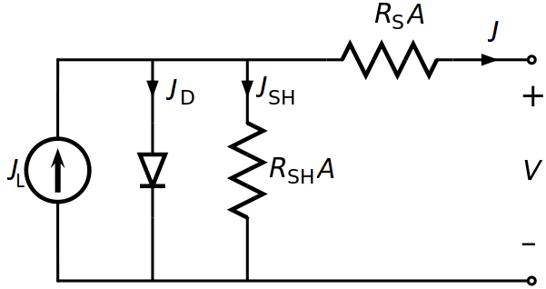

Tutorial 2: I-V curve of a one-dimensional *pn* heterojunction
--------------------------------------------------------------

In this tutorial we consider a more complex system in 1-dimension: a heterojunction with a Schottky back contact.  The n-type material is CdS and the p-type material is CdTe.  The structure of the script is the same as in the last tutorial, however we must provide more detail to describe a more complex system.  

.. seealso:: The example treated here is in the file ``1d_heterojunction.py`` located in the
   ``examples\tutorial2`` directory of the distribution.  The same simulation's GUI input file is ``1d_heterojunction.ini``, also located in the ``examples\tutorial2`` directory.

The band diagram for this 
system under short-circuit conditions is shown below
.

.. image:: hetero_bands.*
   :align: center

Constructing a grid and building the system
...........................................

We first define the thicknesses of the n-type and p-type regions::

    t1 = 25*1e-7    # thickness of CdS
    t2 = 4*1e-4     # thickness of CdTe

The mesh for a heterojunction should be very fine in the immediate vicinity of the materials interface.  We define a distance ``dd``, which determines the thickness of the highly-refined mesh near an interface.  We form the overall system mesh by concatenating meshes for different parts of the system as follows::

    	dd = 3e-6 # 2*dd is the distance over which mesh is highly refined
	x = np.concatenate((np.linspace(0, dd, 10, endpoint=False),                # L contact interface
                    np.linspace(dd, t1 - dd, 50, endpoint=False),                    # material 1
                    np.linspace(t1 - dd, t1 + dd, 10, endpoint=False),             # interface 1
                    np.linspace(t1 + dd, (t1+t2) - dd, 100, endpoint=False),       # material 2
                    np.linspace((t1+t2) - dd, (t1+t2), 10)))                       # R contact interface

As before we make a system with :func:`~sesame.builder.Builder`::

    sys = sesame.Builder(x)

Adding material properties
...........................................

We make functions to define the n-type and p-type regions as in the last tutorial::

    def CdS_region(pos):
        x = pos
        return x<=t1 

    def CdTe_region(pos):
        x = pos
        return x>t1  

Now we add materials to our system.  We define two dictionaries to describe the two material types::

    CdS = {'Nc': 2.2e18, 'Nv':1.8e19, 'Eg':2.4, 'epsilon':10, 'Et': 0,
        'mu_e':100, 'mu_h':25, 'tau_e':1e-8, 'tau_h':1e-13, 'affinity': 4.}

    CdTe = {'Nc': 8e17, 'Nv': 1.8e19, 'Eg':1.5, 'epsilon':9.4, 'Et': 0,
        'mu_e':320, 'mu_h':40, 'tau_e':5e-9, 'tau_h':5e-9, 'affinity': 3.9}

As in the last tutorial, we add materials using the ``sys`` method :func:`~sesame.builder.Builder.add_material`.  This time we specify the material location using the functions we defined above as additional input arguments to :func:`~sesame.builder.Builder.add_material`::

    sys.add_material(CdS, CdS_region)     # adding CdS
    sys.add_material(CdTe, CdTe_region)     # adding CdTe

Adding dopants
...........................................

Adding the dopants works as in the last tutorial::

    
    nD = 1e17  # donor density [cm^-3]
    sys.add_donor(nD, CdS_region)
    nA = 1e15  # acceptor density [cm^-3]
    sys.add_acceptor(nA, CdTe_region)

Specifying contact types
...........................................

Next, we'll add a left Ohmic contact and a right Schottky contact.  For Schottky contacts, we must to specify the work function of the metal.  As in the previous tutorial, we add contacts to the system using the ``sys`` method :func:`~sesame.builder.Builder.contact_type`; however this time we provide the additional arguments of the left and right contact work functions to :func:`~sesame.builder.Builder.contact_type`::

    Lcontact_type, Rcontact_type = 'Ohmic', 'Schottky'
    Lcontact_workFcn, Rcontact_workFcn = 0, 5.0   # eV  

    sys.contact_type(Lcontact_type, Rcontact_type, Lcontact_workFcn, Rcontact_workFcn)

Note that for Ohmic contacts, the metal work function doesn't enter into the problem, so its value is unimportant - we therefore simply set the left contact work function equal to 0.  
Having defined the contact types, we next specify the contact recombination velocities as before.  For this system, we'll assume the contacts are non-selective::

    Sn_left, Sp_left, Sn_right, Sp_right = 1e7, 1e7, 1e7, 1e7  # cm/s
    sys.contact_S(Sn_left, Sp_left, Sn_right, Sp_right)

Computing an I-V curve
......................
We've now completed the system definition.  As in the last example, we compute the equilibrium solution, add illumination, and compute the I-V curve

.. warning::
   Sesame does not include interface transport mechanisms of       thermionic emission and tunneling.

:: 

    phi = 1e21 # photon flux [1/(cm^2 s)]
    alpha = 2.3e6 # absorption coefficient [1/cm]

    # Define a function for the generation rate
    f = lambda x: phi * alpha * np.exp(-alpha * x)
    sys.generation(f)

    voltages = np.linspace(0, 0.95, 40)
    j = sesame.IVcurve(sys, voltages, '1dhetero_V')
    # convert dimensionless current to dimension-ful current
    j = j * sys.scaling.current

The current can be saved and plotted as in the previous tutorial::

    result = {'v':voltages, 'j':j}   # store j, v values 
    np.save('jv1d_hetero', result)    # save the j-v curve
 
    import matplotlib.pyplot as plt
    plt.plot(voltages, j,'-o')        # plot j-v curve
    plt.xlabel('Voltage [V]')
    plt.ylabel('Current [A/cm^2]')
    plt.grid()                       # show grid lines
    plt.show()                       # show plot

.. image:: jv_hetero.*
   :align: center

Adding contact and shunt resistance
...................................

We next demonstrate how to include the effect of series and shunt resistance.  The example treated here is in the file ``1d_heterojunction_with_Rs_Rsh`` located in the ``examples\tutorial2`` directory of the distribution.  The classic equivalent circuit model for a solar cell is given below (note we use current density :math:`J` and resistance-area product to characterize the circuit).

For our model, the diode in this circuit is replaced by the numerically computed current-voltage relation shifted by the computed short-circuit current, so that :math:`J_{{\rm diode}}^{{\rm dark}}(0)=0`). The light source current :math:`J_L` is given by the numerically computed short-circuit current density.  The current-voltage relation of the above circuit is given by the following implicit equation:

.. math::
    J  = J_L - J_{{\rm diode}}^{{\rm dark}}(V-J R_{\rm s}A) - \frac{V+J R_{\rm s} A}{R_{{\rm sh}}A}.

For a fixed potential drop across the circuit :math:`V`, the above equation is solved numerically to find the total current through the circuit :math:`J`.  Below we show the effect of finite series and contact resistance values (given by :math:`R_{\rm s}` and :math:`R_{\rm sh}` respectively) on the current-voltage relation computed in the first part of the tutorial:

.. image:: JV_contacts.*
   :align: center

We refer the reader to the example script for more details of how the mathematics of the equivalent circuit model is implemented.

