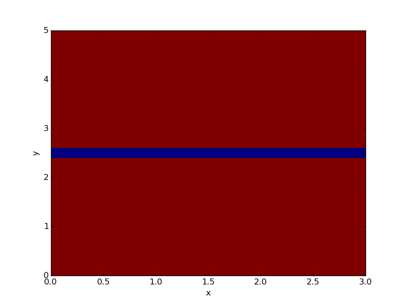
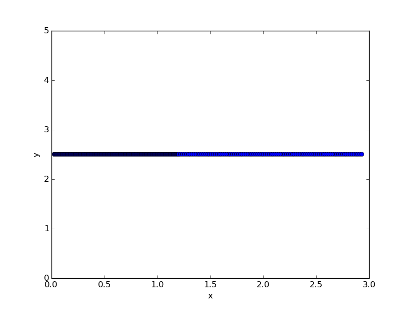

Tutorial 2: Two-dimensional pn junction with a line defects
-------------------------------------------------------------
In this tutorial we show how to build a two-dimensional pn junction containing a
line defects. We focus on the creation of different regions and the addition of
extra charges to the system. See :doc:`tutorial 1 <tuto1>` for the basics on the
creation of systems. We present the tools available to vizualize the system
created.

.. seealso:: The example treated here is in the file ``2dpn.py`` in the
   ``examples`` directory in the root directory of the distribution. 

Multiple regions in a two-dimensional system
...............................................
Suppose we want to simulate a two-dimensional pn junction (homojunction) with a
line of defects as depicted below.  

.. image:: geometry.*
   :align: center

As usual, we start by importing the sesame package and numpy. We construct the
mesh of the system and make an instance of the :func:`~sesame.builder.Builder`.
We will consider a line defects at :math:`y=2.5~\mathrm{\mu m}`, so we use a
grid with a finer lattice around it::

    import sesame
    import numpy as np

    # dimensions of the system
    Lx = 3e-6 # [m]
    Ly = 5e-6 # [m]

    # extent of the junction from the left contact [m]
    junction = 10e-9 

    # Mesh
    x = np.concatenate((np.linspace(0,1.2e-6, 150, endpoint=False), 
                        np.linspace(1.2e-6, Lx, 50)))
    y = np.concatenate((np.linspace(0, 2.25e-6, 50, endpoint=False), 
                        np.linspace(2.25e-6, 2.75e-6, 50, endpoint=False),
                        np.linspace(2.75e-6, Ly, 50)))

    # Create a system
    sys = sesame.Builder(x, y, input_length='m')

    def region(pos):
        x, y = pos
        return x < junction

    # Add the donors
    nD = 1e17 * 1e6 # [m^-3]
    sys.add_donor(nD, region)

    # Add the acceptors
    region2 = lambda pos: 1 - region(pos)
    nA = 1e15 * 1e6 # [m^-3]
    sys.add_acceptor(nA, region2)

    # Use perfectly selective Ohmic contacts
    sys.contact_type('Ohmic', 'Ohmic')
    Sn_left, Sp_left, Sn_right, Sp_right = 1e50, 0, 0, 1e50
    sys.contacts(Sn_left, Sp_left, Sn_right, Sp_right)

We want to have a reduced mobility around the line defects compared to the rest
of the system. Therefore we need to define two regions in our system, two large
regions with mobility :math:`200~ \mathrm{cm^2/(V\cdot s)}` and a smaller one
around the line defect with mobility :math:`20~\mathrm{cm^2/(V\cdot s)}`. The
function that defines the region for :math:`y<2.4~\mathrm{\mu m}` and
:math:`2.6~\mathrm{\mu m}` is below::

    def region1(pos):
        x, y = pos
        return (y < 2.4e-6) | (y > 2.6e-6)

    # Dictionary with the material parameters
    reg1 = {'Nc':8e17*1e6, 'Nv':1.8e19*1e6, 'Eg':1.5, 'epsilon':9.4,
            'mu_e':200*1e-4, 'mu_h':200*1e-4, 'tau_e':10e-9, 'tau_h':10e-9}

    # Add the material to the system
    sys.add_material(reg1, region1)

In the definition of ``region1``, observe how we define the statement OR. Here
we use a bitwise logical operator. Other useful operators are ``&`` for AND,
``~`` for NOT. Statements on each side of an operator must be in between
parentheses.  We can easily use ``region1`` to define the second region, since
all sites not in region 1 will be in region 2::

    # Dictionary with the material parameters
    reg2 = {'Nc':8e17*1e6, 'Nv':1.8e19*1e6, 'Eg':1.5, 'epsilon':9.4,
            'mu_e':20*1e-4, 'mu_h':20*1e-4, 'tau_e':10e-9, 'tau_h':10e-9}

    # Add the material to the system
    sys.add_material(reg2, lambda pos: 1 - region1(pos))

Now we add some local charges to simulate the defect line of our system. We
define a defect gap state as follows::

    # gap state characteristics
    s = 1e-15 * 1e-4         # trap capture cross section [m^2]
    E = -0.25                # energy of gap state (eV) from midgap
    N = 2e13 * 1e4           # defect density [1/m^2]

    # Specify the two points that make the line containing additional charges
    p1 = (20e-9, 2.5e-6)   #[m]
    p2 = (2.9e-6, 2.5e-6)  #[m]

    # Pass the information to the system
    sys.add_line_defects([p1, p2], N, s, E=E, transition=(1/-1))

The type of the charge transition :math:`\alpha/\beta` is specified as
shown above. In our example we chose a mixture of donor and acceptor at energy
E. An acceptor would be described by (-1,0) and a donor by (1,0).

.. note::
   * Avoid adding charges on the contacts of the system, as these will not be
     taken into account. The code is not equiped to deal with such boundary
     conditions.
   * In order to add another gap state at a different energy at the same
     location, one repeats the exact same process.  
   * Here we assumed equal electron and hole surface recombination velocities.
     The function :func:`~sesame.builder.Builder.add_line_defects` takes two
     surface recombination velocities as argument. The first is for electrons,
     the second for holes. To use different values write

     .. code-block:: python

        sys.add_line_defects([p1, p2], N, sn, sp, E=E)
   * A continuum of states can be considered by omitting the energy argument
     above. The density of states can be a callable function or a numerical
     value, in which case the density of states is independent of the energy.

Visualizing the system
........................
In order to make sure that we chose a discretization that renders correctly our
system, two functions are available for this purpose in two-dimensions. These
plotting routines require the Matplotlib library. First we visualize the
mobility across the system::

    sesame.plot(sys, sys.mu_e)

We have successfully created two regions with different mobilities.
The exhaustive list of all the parameters accessible (like mobility, bulk
lifetime) is in the documentation of the :func:`~sesame.builder.Builder` class
itself.

We can also visualize the line defects, as shown below::

    sesame.plot_line_defects(sys)

